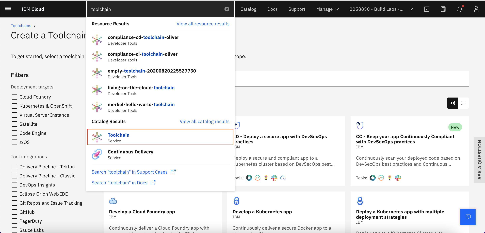

# How to use a Toolchain

In this document we cover the basics of a toolchain.
By reading it you will be able to:

- Create a toolchain with CI/CD and deploy your application.
- Deploy applications from source to code.
- Access your deployed application on your K8's Cluster.
- Autoscale your deployment.

## Creating a kubernetes cluster

Create you kubernetes cluster in [IBM Cloud](https://cloud.ibm.com/kubernetes/catalog/create)

After provisioned, connect to your kubernetes cluster using the [IBM Cloud CLI](https://cloud.ibm.com/docs/cli?topic=cli-getting-started)

## Installing basic plugins

We are going to need two plugins:

To install them you are going to run these commands on your terminal

Container-service plugin

`ibmcloud plugin install container-service`  

Container registry

`ibmcloud plugin install container-registry`

## Connecting to your kubernetes cluster

After you installed those plugins go to your cluster page on IBM Cloud.

On the top right side of the screen click in `Actions -> Connect via CLI`


And follow the steps described there:

Log in your ibm cloud account:

`ibmcloud login -r us-south -g <YOUR_RESOURCE_GROUP> [OPTIONAL ->] --sso`

Set the kubernetes context to your cluster:

`ibmcloud ks cluster config --cluster <YOUR_CLUSTER_ID>`

Verify if your context is right:

`kubectl config current-context`

## Creating a Toolchain

In your IBM Cloud catalog look for `Toolchain`



Click on `Deploy a Kubernetes App with multiple deployment Strategies`


Choose a name for your toolchain and the resouce groups


Select your deployment strategy. Here we are going with `Rolling`


Click on Application and choose the Source provider that best fits to your needs.

We will go with github and a public repo


Click in `bring your own application`

Then choose the repo that you want to deploy.

In inventory click on `create new inventory repository` and choose a name.


In secrets disable everything.


In deployment target choose a name to your app and insert an api key there, if you don't have one. Click on `New`

Attention: `App name will be the name of your deployment`

Choose the container registry namespace. if you don't have a container registry namespace you can [create one](https://cloud.ibm.com/registry/namespaces)


Then select your resouce group again, then select your cluster and your cluster namespace.

Make sure you have the right cluster selected.

Then click on `Create Toolchain`.


To see your deployment run:

`kubectl get namespace`

You should look for the cluster namespace that you added in your toolchain.

In our case is `prod`

Set your current namespace to where your app is deployed.

` kubectl config set-context --current --namespace=prod`

To see your deployments run:

`kubectl get deployments`

Then you'll need to see the name of your new deployment on your cli.

In our case is:

`merkel-hello-test`

To see the port that our app is running, run:

`kubectl get service <your_deployment_name>`

Expected output:

```
NAME                                 TYPE       CLUSTER-IP       EXTERNAL-IP   PORT(S)          AGE

merkel-hello-test                     NodePort   172.21.191.131   <none>        3000:32334/TCP   98m
```


To access our app we will use the port `32334`

So, to see your app running, run:

`ibmcloud ks workers --cluster <YOUR_CLUSTER_ID OR YOUR_CLUSTER_NAME>`

Get the public IP.

Then access your app by putting in your browser:

`<YOUR_CLUSTER_PUBLIC_IP>:<APP_PORT>`


## How to create a autoscaler for Kubernetes.

`kubectl autoscale deployment my-app --max 6 --min 4 --cpu-percent 50`

how to scale an application manually:

`kubectl scale --replicas=<number_of_replicas> deployment/<deployment_name>`

Tip: When we perform this scalling we are scalling **pods**, that means that we are scalling **logically** and not physically. You will not see the number of workers rise on your ibm cloud kubernetes instance.

To scale your cluster physically you will need to enable the [Cluster Autoscaling Addon](https://cloud.ibm.com/docs/containers?topic=containers-cluster-scaling-install-addon)

If you want to know more about scalling methods please reffer to [Scalling Resources](https://kubernetes.io/docs/reference/kubectl/cheatsheet/#scaling-resources)


